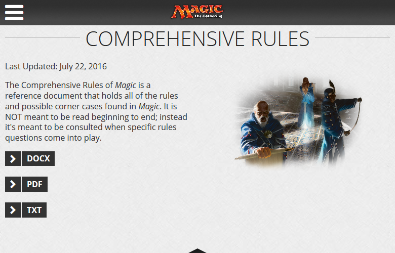
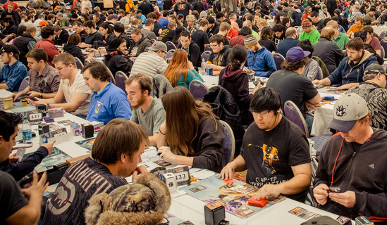
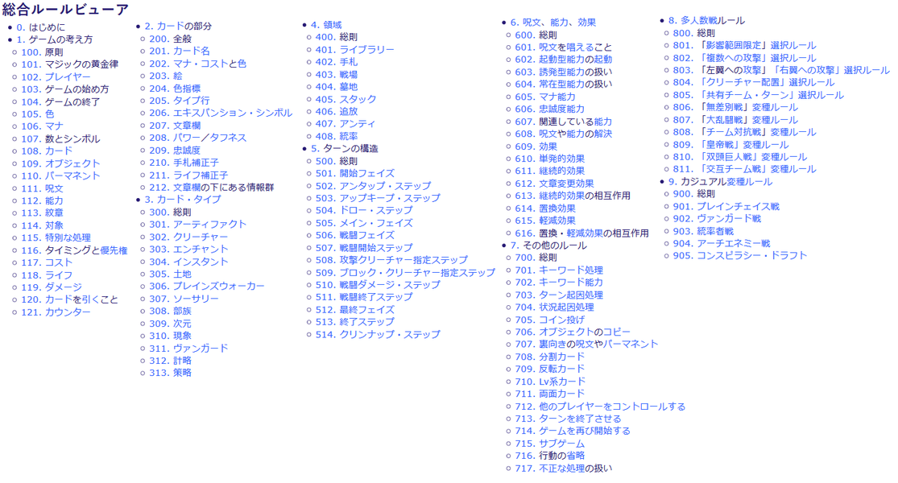
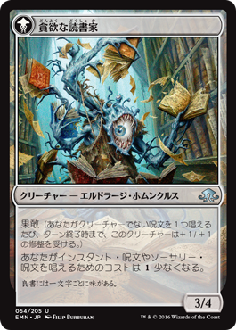
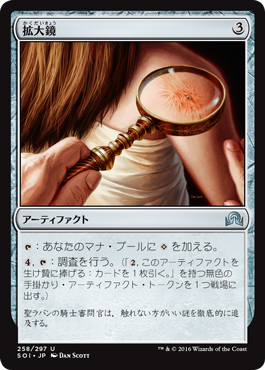
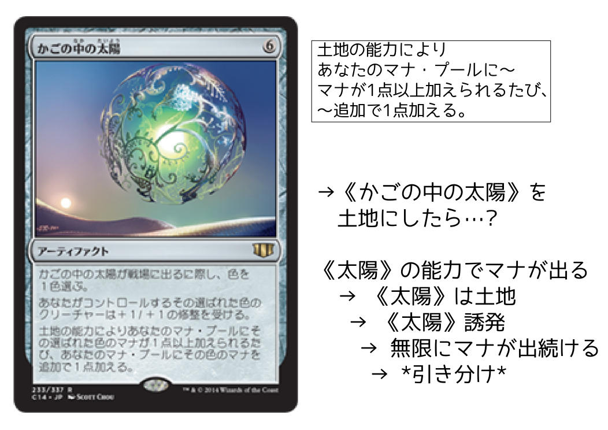
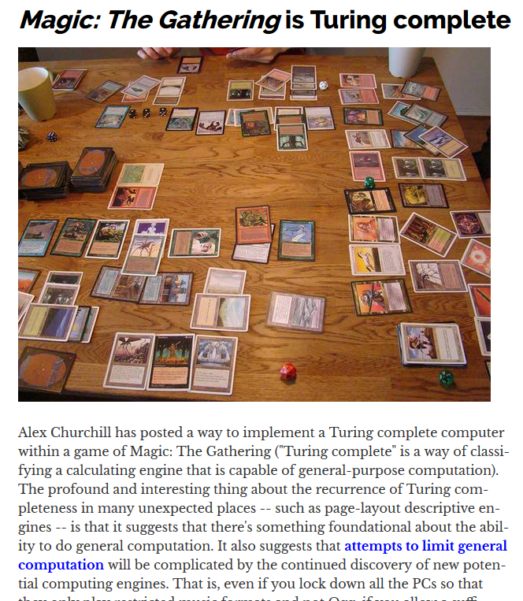

## 重箱の隅のつつき方

by nobita

# 重箱?

##

# MtG ?

## Magic: the Gathering
+ 世界初のTCG
+ 発売から今年で23年
+ 高価なカードは車より高い
+ 世界選手権とかプロ制度とかもある

##
  

## MtG 総合ルール
+ 世界中で人気のTCG「Magic: the Gathering」のルール
+ 重厚 1,335,426バイト
    + _
    + 

## 基本的には
 

## ターンの流れ
1. カードを7枚ぐらい引く
2. 各ターンごとに
    1. 1枚引く
    2. __土地__ カードを並べる
    3. __マナ__ を土地から出して __呪文__ を唱えたり
        + __クリーチャー__, __ソーサリー__, ...
    4. カードの __能力__ を起動したり
    5. __クリーチャー__ で相手を殴る
3. ライフが20から0になったプレイヤーの負け

# MtGプレイヤーの分類

##

## ティミー,ジョニー,スパイク
+ ティミー
    + ゲームに体験やカタルシスを求める
+ ジョニー
    + ゲームに自己表現の場を求める
+ スパイク
    + ゲームで己の実力を示すことを求める

## それ以外

## *ルールグル*
ルールをこねくり回し,
奇妙な状況を思考実験することを楽しむ**変態**

# ルールグルになるには

## 1. 総合ルールを読む

## 2. もっと総合ルールを読む

## 3. 更に総合ルールを読む

## 4. 怪しいカード群をにらみつける

## 5. 状況をフォーラムに投げる

# 事例

## 
+ 

## 
+ 

## 
+ 

## 
+ 

# 工学部っぽい話

## 
+ [Magic: The Gathering is Turing complete](http://boingboing.net/2012/09/12/magic-the-gathering.html)
+ 

# おわり

##
+ 

